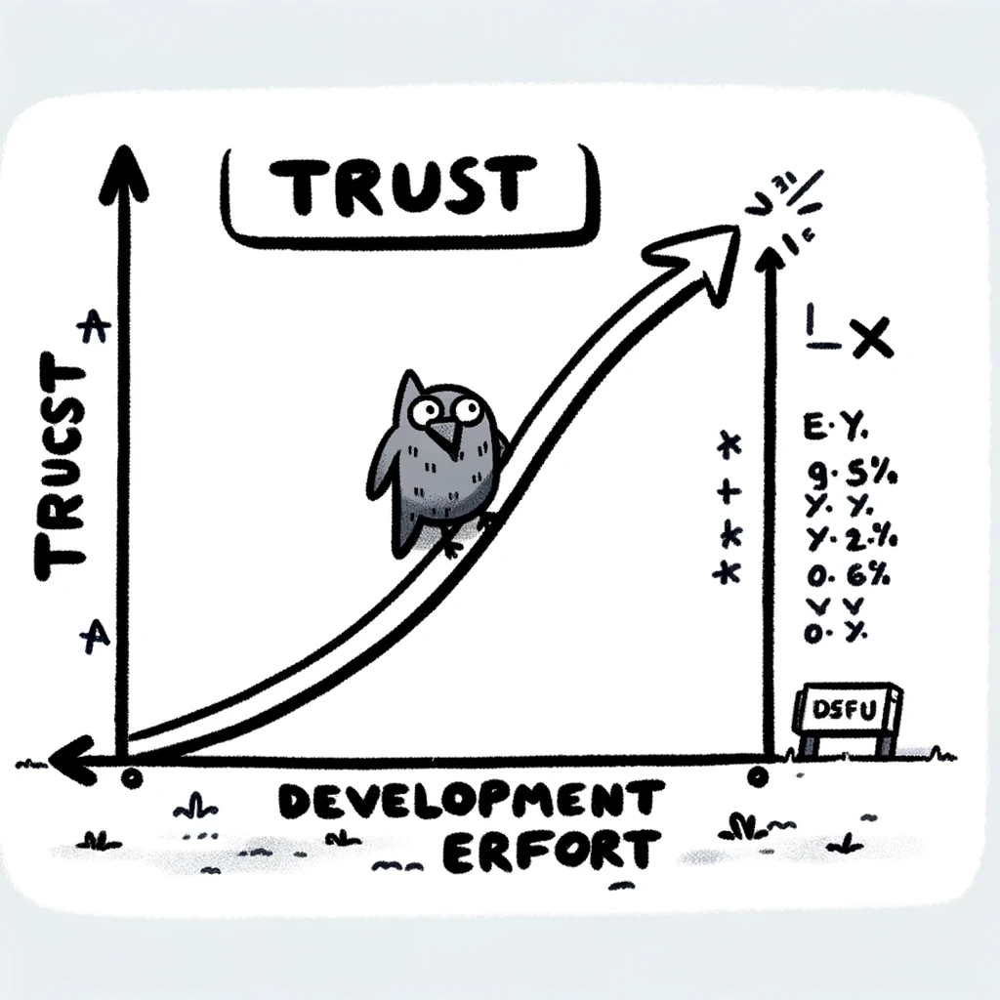

# Do you trust it?

We have lived in a period of AI shift for the past few years.
AI is everywhere: searching, learning, text processing, code review, code writing assistance, and many other systems have arisen in recent years. 
It seems everyone is eager to apply AI wherever possible — and even where it might not be.
I'm not an exception. 
Under the influence of this wave, I decided to try to create something on my own that would help me in everyday life. 
So here I will tell you my own story of writing an application with the use of AI, along with some thoughts about it, of course, which are rather contradictory.

## What is the task?

As a developer in a distributed team, I often need to explain my weekly progress to my colleagues. 
Our team prefers text-based reports over face-to-face communication for many reasons.
I know that for some it might look contradictory, but all the benefits of this approach have been mentioned many times already, and it’s just how we prefer to do it.
So, after a while, we came up with a particular document format and structure for our weekly reports. 
It is called [SIMBA](https://www.yegor256.com/2021/09/09/simba.html). 
This format is extremely simple:


```md
From: Team Coordinator
To: Big Boss
CC: Programmer #1, Programmer #2, Friend #1, etc.
Subject: WEEK13 Dataset, Requirements, XYZ 

Hi all,

Last week achievements:
- Added 100 new files to the Dataset [100%]
- Fixed the deployment of XYZ [50%]
- Refined the requirements [80%]
Next week plans:
- To publish ABC package draft
- To review first draft of the report
Risks:
- The server is weak, we may fail the delivery
  of the dataset, report milestone will be missed.

Bye.
```

This report is typically short and straightforward. 
As you can see, there are only three key parts to summarize based on last week's results.

But if you're doing this every week, it can get tedious. Extremely tedious. 
Sometimes, it's a real challenge to recall what you were up to at the start of the previous week, which issues you planned to solve, and which are better to leave for the next week.
Moreover, you have to keep in mind all possible risks and problems that might arise from the changes you made along the way.
So why don't we generate this report automatically?

In this blog, we will write a small [app](https://github.com/volodya-lombrozo/newsman) that generates a report based on GitHub user activity.
This information allows us to build a detailed report.
However, the activity data is often poorly formatted due to the lack of rigid conventions for commits, issues, and pull requests.
Even if such formatting existed, it might vary between projects.
Frankly, we don't want to create these strict rules and style guidelines — it’s tedious.
Instead, we have AI to extract and format all the parts of the report for us.

## Can you just generate it for us?

We don't have much time to write a complex script or application for this task. 
We have many other responsibilities at our job, so we simply can't allocate time for it. 
Let's start with a straightforward, initial attempt to generate the report.
We'll focus on the 'Last Week Achievements' section now and delegate as much work as possible to AI.

Typically, we can assess a developer's work by reviewing completed pull requests—the actual code provided.
So, we'll fetch a list of closed pull requests from the previous week using the GitHub API,
convert their titles and bodies to simple strings, 
join them with a '____' delimiter, and send them to the AI with the following prompt:

Context:
```txt
You are a developer tasked with composing a concise report detailing your activities and progress for the previous week, intended for submission to your supervisor.
```
Prompt (it's boring):

```txt
Please compile a summary of the work completed in the following Pull Requests (PRs). 
Each PR should be summarized in a single sentence, focusing more on the PR title and less on implementation details.
Group the sentences by repositories, each identified by its name mentioned in the 'repository:[name]' attribute of the PR.
The grouping is important an should be precise. 
Ensure that each sentence includes the corresponding issue number as an integer value.
If a PR doesn't mention an issue number, just print [#chore]. 
Combine all the information from each PR into a concise and fluent sentence, as if you were a developer reporting on your work.
Please strictly adhere to the example template provided.
Example of a report: #{example}. List of Pull Requests: [#{prs}]"}
```

That is it. We didn't do any grouping programmatically; we didn't prepare data; we didn't even write the prompt ourselves. 
I asked AI to generate it for us, of course. 
(So, am I a prompt engineer?)
And... we have great results.

```txt
Last week achievements.
  jeo-maven-plugin:
  - Implemented disassembling of remaining instructions [#509]
  - Identified the problem with switch statement disassembling [#488]
  - Updated Qulice version to 0.22.2 [#chore]
  - Handled all bytecode instructions and updated plugin version [#488]
  - Improved performance of integration tests by optimizing cache usage [#499]
  - Made label identifier accessible in XmlLabel class [#497]

  opeo-maven-plugin:
  - Updated Jeo version to 0.3.4 [#190]
  - Enabled all integration tests and improved label handling [#189]
```

It's hard to show you here, but the AI got confused and mixed up several pull requests across different repositories, losing some items from the report in the process. 
However, it did manage to combine parts of each PR into concise, readable sentences — exactly what we need. 

So, for now, we can review the text in the report manually, add any missing points, and fix a few sentences to restore their meaning. 
Once that's done, we'll be ready to send the first version of our report.
Good.

Further, I won't include all the results because they would make the text excessively long and potentially confusing. 
However, if you are really interested, 
I have published the complete [history](https://volodya-lombrozo.github.io/newsman/) of the results I obtained along the way.
Additionally, I have the [repository](https://github.com/volodya-lombrozo/newsman) with all the code, so you can check it as well.

## What about the future?

For the 'Next Week Plans' section, we can follow a similar approach since there is nothing special. 
The only difference is the source of data.
In our team, we don't have any special software to track tasks like boards, backlog, and similar. 
We use plain GitHub issues, as many other open-source projects do. 
Hence, we can focus on issues opened by a developer in the last month, as these are the ones we will likely address sooner. 
Of course, most of them won't be resolved during the next week, so the developer will need to remove the ones they won't solve during the following week.

In other words, we can get a list of issues created by a developer for the last month, join them using '____' delimeter and send them with the following 
prompt.

```txt
Please compile a summary of the plans for the next week using the following GitHub Issues descriptions. 
Each issue should be summarized in a single sentence, focusing more on the issue title and less on implementation details. 
Group the sentences by repositories, each identified by its name mentioned in the 'repository:[name]' attribute of the issue.
Pay attention, that you din't loose any issue. 
The grouping is important an should be precise.
Ensure that each sentence includes the corresponding issue number as an integer value.
If an issue doesn't mention an issue number, just print [#chore]. 
Combine all the information from each Issue into a concise and fluent sentences, as if you were a developer reporting on your work.
Please strictly adhere to the example template provided: #{example_plans}. List of GitHub issues to aggregate: [#{issues}].
```

And we got more or less appropriate results in a human-readable format that are almost ready to be presented to the team.

```txt
Next week plans:
jeo-maven-plugin:
- Refactor Annotations Implementation in BytecodeAnnotation.java for simplification and readability [#532]
- Investigate and fix the issue of automatic frame computation in CustomClassWriter to prevent test failures [#528]
- Enable 'spring' Integration Test in pom.xml by adding support for various Java features [#488]
```

Moreover, sometimes AI can be smart enough to improve the report even without any special instructions from us.
For example, once it was able to group a list of separate issues with similar content and purpose.

```txt
opeo-maven-plugin:
 - Add unit tests for the XmlParam class [#598], XmlAttributes class [#595], XmlAttribute class [#594], DirectivesNullable class [#593], DirectivesAttributes class [#592], and DirectivesAttribute class [#591] to improve code coverage and code quality.
```

However, here we also encountered the same problems with the structure, formatting, and confusion as in the 'Last Week's Achievements' section.
So, we still need to perform some editing before sending the report.

P.S.
After several weeks, cleaning plans that I didn't want to address soon became extremely tedious.
To simplify this task, we might add (I did exactly this) a [label](https://docs.github.com/en/issues/using-labels-and-milestones-to-track-work/managing-labels) for the issues we plan to solve in the near future.
By doing this, we no longer need to spend much time on this section.

## Risks 

Now let's move to the most exciting part: risk identification, specifically our last 'Risks' section in the report.
Typically, developers mention some risks and possible problems in PR descriptions. 
Actually, they can be mentioned anywhere, but let's start with something simple.

I asked AI to generate the following prompt to identify risks from pull requests descriptions:

```txt
Please compile a summary of the risks identified in some repositories. 
If you can't find anything, just leave answer empty.
Add some entries to a report only if you are sure it's a risk.
Developers usually mention some risks in pull request descriptions. 
They either mention 'risk' or 'issue'. 
I will give you a list of pull requests. 
Each risk should be summarized in a single sentence.
Ensure that each sentence includes the corresponding issue number or PR number as an integer value. 
If a PR or an issue doesn't mention an issue number, just print [#chore].
Combine all the information from each PR into a concise and fluent sentence, as if you were a developer reporting on your work.
Please strictly adhere to the example template provided. 
Example of a report: #{example_risks}. List of Pull Requests: ```#{all}```.
```

Unfortunately, it didn't work as expected this time.
Not all code changes carried risks, so the AI often tried to invent new risks where there were none.
Sometimes it simply repeated the PR description without identifying any problems. 
Other times, it printed risks from the example provided instead of from the real data. 
It also frequently confused PR numbers when it found risks.
In other words, it was a mess.

Most likely, the key problem was with my prompt. 
I tried several modifications, but the results remained more or less the same.

So, we can give some clues to the AI and start writing all PR descriptions as clearly as possible. 
And... surprise, surprise, it helps. 
For this PR description:

```txt
During the implementation of this issue, I identified some problems which might cause issues in the future:
Some of the decompiled object values look rather strange, especially the field default values - they have the '--' value.
We need to pay attention to the mapping of these values and fix the problem. 
For now, it doesn't create any issues, but it's better to deal with it somehow.
```

we get the following result:

```txt
Risks:
jeo-maven-plugin:
- In PR Update All Project Dependencies, there is a risk related to strange decompiled object values with -- default values that may need attention in the future [#199].
```

The more human-readable messages we leave, the easier it is for AI to analyze results.
(Who would've thought, right? 🤔)
As a result, we've now developed much better - styled, grammatically correct, and descriptive messages in our issues and pull requests that are more understandable.
So, it’s a nice improvement for people who read our PRs, not just for AI processing.

However, I should admit that in some cases when we need to go beyond that, we can add additional markers like 'Risk 1: ...,' 'Risk 2: ...' in the text
(as I did [here](https://github.com/objectionary/opeo-maven-plugin/pull/259)) to get more precise answers from the AI. 
By doing this, the AI almost didn't make any mistakes. 
But do we really need the AI in this case at all? 

As you can see, it's exactly what we initially didn't want to do at all – structure text and add meta information to PRs and issues. 
How ironic.

## Let's improve it?

Even though we've implemented all these parts, 
We still had to handle much of the work, including structuring, formatting, and making sure each generated sentence actually made sense.
I'm not sure if we can fix the problem related to meaning verification. 
It's just easier to do it manually, at least for now. 
So, we're left with some structural and formatting problems. 
To illustrate, just take a look at the report we generated.

```txt
Last week achievements:
jeo-maven-plugin:
* Remove Mutable Methods [#352]

Next week plans:
opeo-maven-plugin:
- Fix 'staticize' optimization [#207]

Risks:
    jeo-maven-plugin:
       - The server is weak, we may fail the delivery of the dataset, report milestone will be missed [#557].
```

Since we made three separate requests, the responses predictably came back in different formats. 
We have at least one simple and fast solution to this problem. 
Can you guess which one? 
That's right, let's throw even more AI at it. More and more AI!
Alright, let's not get carried away. 
For now, we can just add one more request.

```
I have a weekly report with different parts that use various formatting styles.
Please format the entire report into a single cohesive format while preserving the original text without any changes.
Ensure that the formatting is consistent throughout the document.

Here is the report:

#{report}
```

And it works. 

```txt
Last week achievements:
jeo-maven-plugin:
- Remove Mutable Methods [#352]

Next week plans:
opeo-maven-plugin:
- Fix 'staticize' optimization [#207]

Risks:
jeo-maven-plugin:
- The server is weak, we may fail the delivery of the dataset, report milestone will be missed [#557].
```

However, we have different formatting styles between reports now, which is okay in this case. 
Though it looks a bit strange since each week I have differently formatted reports.
Maybe it gives the impression of a real person.

The second feature we can apply to improve our reports is to use the better AI model. 
I haven't mentioned this yet; all the previous requests we made were with an old but relatively cheap model, GPT-3.5-turbo. 
So, to be honest, let's spend more money to check out the newest GPT-4 model. 
And it works much better. 
It is subjective, of course, but my perception tells me that the results look better in most cases. 
Again, you can check the difference [here](https://volodya-lombrozo.github.io/newsman/).

And the final improvement involved the format of the input data for the pull requests and issues we submit to the AI.
Initially, as you remember, we didn't spend much time preparing the data.
However, we can switch from unstructured text with delimiters to JSON, which seems to help.
Although I don't have concrete proof, but it appears that the AI makes fewer mistakes.

In summary, we can continue and build more pipelines with chained requests, pay more money, format the input data, and so on.
And it will probably yield some gains.
But, to be honest, do we really need to spend more time on these tasks? I don't think so. 
Moreover, I have a strong feeling that all these problems might be solved much more easily programmatically even without the use of AI.
So, I belive that the current solution is enough for us. And it's better to stop now.

## Bird's-eye View

Let's agree; we completely changed the original task. 
We formatted the pull request and issue descriptions, 
added meta information like the labels and 'Risk' markers, 
and handled some parts programmatically. 
Moreover, we spent significant time developing these scripts, configuring data, and adjusting prompts, which we initially wanted to avoid altogether.
We still need to validate the report; we can't blindly trust it. 
And I wonder if, after all these changes, we still need an AI at all.

However, did we fail in our attempt to build an AI-based application? 
I can't say that.
Things are not so dramatically bad.
Let's take a look at what we have.
We started the development very quickly. Very quickly.
Initially, we didn't do anything special in terms of formatting or data preparation for AI analysis.
Just a simple prompt with data, and we got raw, full-of-mistakes results.
But we got results! In a few minutes.

Later, when we needed to make our system more precise, we gradually added more code to it. 
We specified the solution, added meta-information, improved prompts, built a chain of requests, and so on. 
I bet if you continue to make the system more precise, you will suddenly realize that you don't need AI at some point. 
And it's fine to remove the AI usage in this case, I believe. 
So, I can illustrate my observations about this development process as follows:



We can quickly achieve full functionality, but initially with low precision. 
Later, as we focus on increasing precision, development time extends, and the use of AI becomes more targeted or reduced. 
And we start to trust our system more.
This creates two extremes: a fully AI-driven system with low precision and a fully programmed system with high precision. 
The development process bridges the gap between these extremes. 
For some systems, low precision is acceptable, such as in our current task.
Maybe we in the future will start creating some systems in this way.
However, for critical applications like those in medicine, finance, and robotics, high precision is essential, and I belive we will continue to code them as we do it now.

## Final Note 

These days, we are experiencing significant growth in AI tools.
Many of these tools have already been integrated into our work processes.
They can generate code or unit tests very effectively, as well as documentation or well-written code comments. 
And yes, this post was written with great help from AI too.
Even the picture in this article was generated by AI. 
Moreover, as I have mentioned, in some cases, AI indirectly improves our systems:
by preparing data to be more readable and understandable by AI systems, we also yield better results for people. 
So, there is definite progress in many areas. 
Most importantly, AI might change the software development process itself in the future.

However, in our example with programmers' activity, the situation is far from perfect.
I hope I have demonstrated this. 
Clearly, we still can't assign such tasks to AI without our intervention, and I'm unsure if we ever will. 
If we look at other systems for code review or PR description summarization, they lack accuracy and still produce many errors. 
Hence, over time, we start to view the outputs of such systems as noise and simply ignore the results. 
In other words, we just can't trust them.

While it is possible and even likely that this will change in the future, for now, I'm still rather skeptical about AI. 
We still need to control and verify its outputs, refine the code to increase precision, build sophisticated chains of prompts, and more. 
And even after all these efforts, we still cannot blindly trust AI.

Perhaps these are just my concerns. What about you? Do you trust it?
